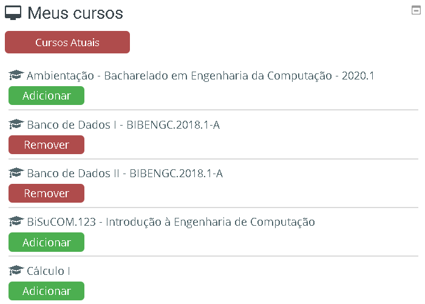
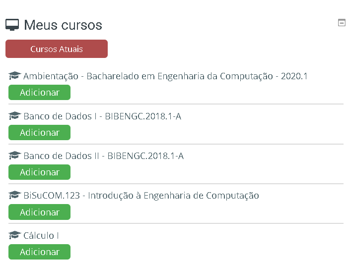
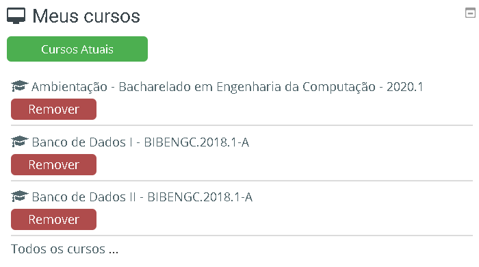

# Meus Cursos

    <h1 style="color: orange;">ℹ Sobre</h1>
    Com essa extensão os alunos conseguem organizar a lista de Meus Cursos no Painel da plataforma EAD do IFMG Campus Bambuí.

## Screenshots

    
     
     
     
    
     
    

